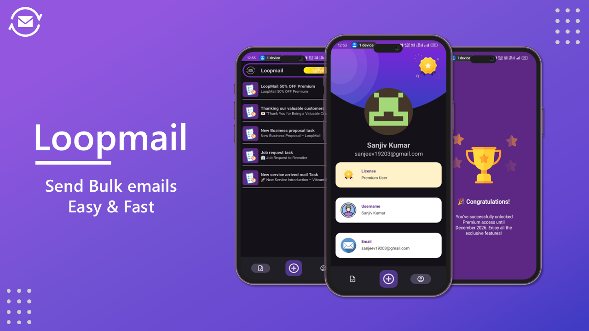
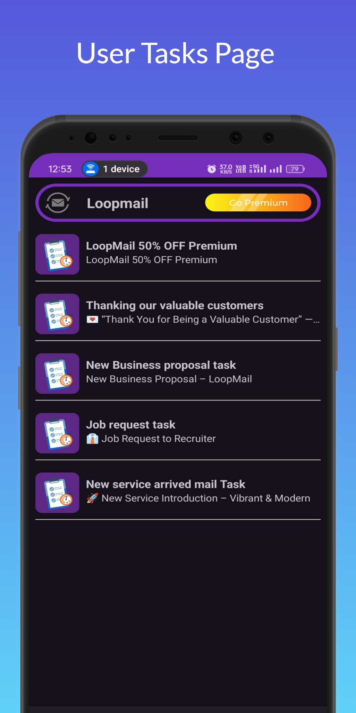
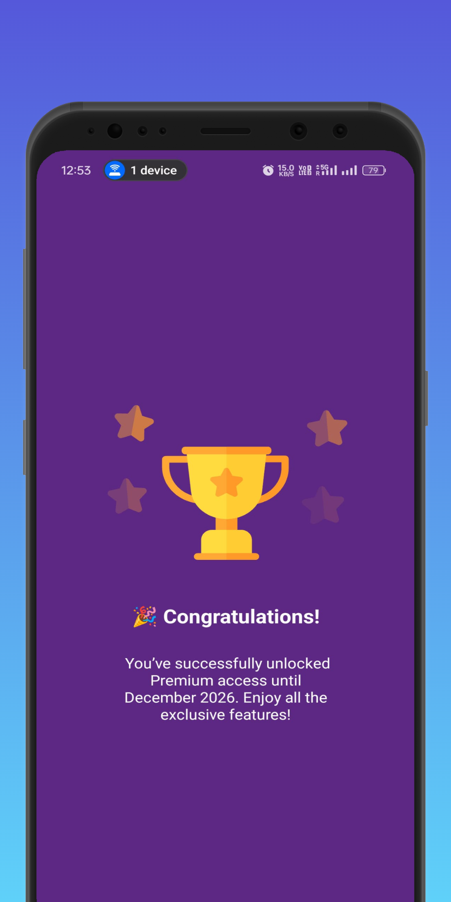
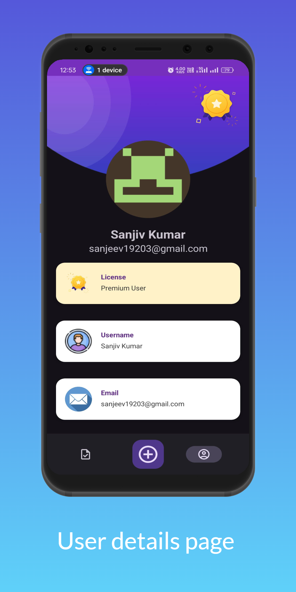

# 📬 LoopMail - Your Smart Email Task Assistant

Welcome to **LoopMail**, your all-in-one Android app for creating, managing, and sending scheduled email tasks effortlessly. Whether you're organizing your work or automating email follow-ups, LoopMail makes it smooth, smart, and simple.



---

## ✨ Features

✅ **Task Creation** – Add and manage email tasks on the go  
✅ **Edit & Update Tasks** – Modify tasks whenever needed  
✅ **Email Integration** – Send custom emails directly from the app  
✅ **Rich Text Support** – Use stunning HTML email templates  
✅ **API Integration** – Smooth interaction with backend services  
✅ **Beautiful UI** – Modern, clean, and intuitive design  

---

## 📱 Screenshots

| Home | Premium | User Info |
|------|-------------|------------|
|  |  |  |

---

## 🛠️ Tech Stack

- **Android (Kotlin/Java)**  
- **Retrofit** for API calls  
- **Gson** for JSON parsing  
- **Material UI** for sleek design  
- **MVVM Architecture**  
- **Node JS**  
- **Express**  
- **MongoDB** 

---

## 🚀 Getting Started

### Prerequisites
- Android Studio (Flamingo or later)
- Android SDK 30+
- Internet access for API operations

### Installation

1. Clone the repository:
   ```bash
   git clone https://github.com/Sanjeev718191/Loopmail-Android
   
2. Open in Android Studio
3. Sync Gradle and run on an emulator or physical device

---

## 💌 Email Templates

LoopMail supports custom HTML templates for beautiful email design.

---

## 🧑‍💻 Author

**Sanjeev Kumar**  
[LinkedIn](https://www.linkedin.com/in/sanjeev-kumar-04556522a/) • [Twitter](https://x.com/Sanjeev_Kumar26)
